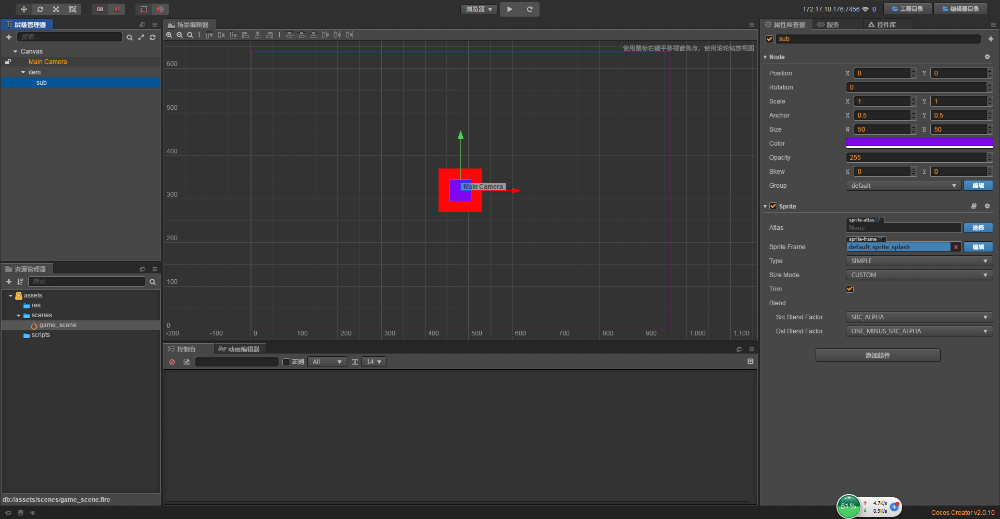

# cc.Vec2

> 概念
1. cc.Vec2是个二维坐标向量，表结构{x: 120, y: 120}; 
    cc.v2(x, y)创建一个二维向量; 
2. Vec2.sub: 向量相减
3. Vec2.add: 向量相加
4. API文档查询Vec2

> 练习
1. 这次我们创建两个单色精灵，一个在canvas下取名为item，改为红色，默认大小是100，100，
    第二个在item下创建，取名为sub，颜色改成蓝色，大小改为50，50 如下图所示
    
    
    
2. 创建脚本**coordinate_space.js**挂载在item上，然后编写代码,创建vec2对象
    ```
        onLoad () {
            let w_pos = new cc.Vec2(100, 100);
            console.log(w_pos);
            w_pos = cc.v2(200, 200);
            console.log(w_pos);
        },
    ```
    
    
    
3. 向量相减
    ```
        let v1 = cc.v2(150, 200);
        let v2 = cc.v2(300, 450);
        let v3 = v1.sub(v2);
        console.log(v3);
    ```
    
    
    
4. 向量相加，小伙伴们自己练习

5. 查询API文档，比如使用API `mag()`返回向量的长度，这里也不多扩展了