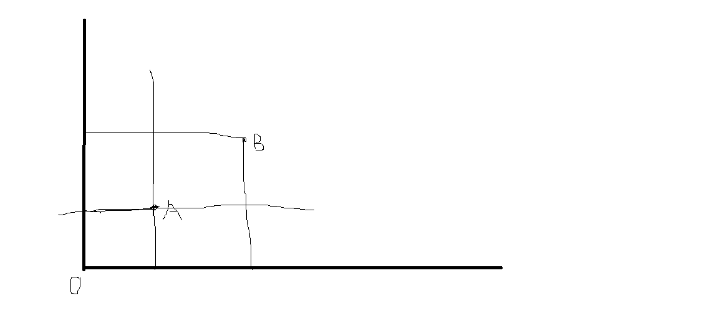
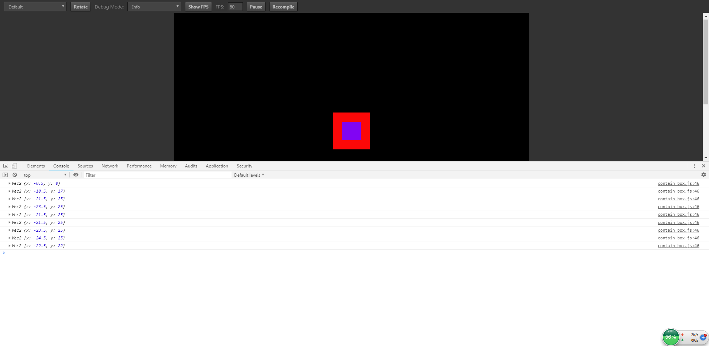

# creator坐标系
> 概念
1. 世界(屏幕)坐标系
2. 节点坐标系，又叫相对坐标系，两种相对节点原点的查找方式
    1. 左下角为原点
    2. 锚点为原点(AR)
3. 节点坐标和屏幕坐标的互相转换
4. 获取在父节点坐标系下的节点包围盒
5. 获取在世界坐标系下的节点包围盒
6. 触摸事件对象世界坐标与节点坐标的转换

> 练习
1. 屏幕坐标的坐标原点在屏幕的左下角，
    从左往右是x轴，从下到上是y轴，和数学的第一象限坐标系一致
2. 节点坐标系，这里要画一张草图
    
    
    
    * O点为世界屏幕坐标系原点(0, 0)
    * 假设A点坐标是(100,100)，B(300,300) ->这里指的是对应世界坐标系
    * 那节点坐标系又是什么意思，比如说B以A为参照为，他的相对坐标系就是(200, 200)
    * B点对于世界坐标系坐标是(300,300)，他的节点坐标系(相对于A点来说)就是(200, 200)
    * 假设A还是个有大小的矩形，那b相对于A的坐标原点是哪个，这里参照概念第二条，在加图说明
    
    
    
    * 图中涂抹的地方就对应2个查找方式，一个是A的左下角,一个是A的锚点  
3. 节点坐标和屏幕坐标的互相转换,编写代码
    1. 节点坐标转换屏幕坐标
        ```
            //节点坐标转到屏幕坐标
            let w_pos = this.node.convertToWorldSpace(cc.v2(0, 0));
            console.log(w_pos);
        ```
        
        
        
        * 我们来研究下430，270这个结果是怎么来的
        * 首先我们的item，它的宽高是100，100
        * 其次我们的Canvas的宽高是960,640，其中心位置480，320是对应屏幕坐标系0，0来说的
        * 因为默认是item的左下角，所以具体的坐标算法就变成了480-100/2和320-100/2
        * 所以才有了这个答案430和270
        * 我们在看下以A的锚点作为起始点的API
        
        ```
            //节点坐标转到屏幕坐标AR
            let w_pos = this.node.convertToWorldSpaceAR(cc.v2(0, 0));
            console.log(w_pos);
        ```
        
        * 如果答案没有错的话，也就是在上面的答案上各加上50，应该是480，320
        
        
        
        * 果然没错
    2. 屏幕坐标转节点坐标
        ```
            //屏幕坐标转节点坐标
            let w_pos = this.node.convertToNodeSpace(cc.v2(480, 320));
            console.log(w_pos);
        ```
        
        
        
        * 我们先看下结果，结果是50，50
        * 来分析下，首先看代码，我们设置了屏幕坐标是480，320
            这两个数字是什么，聪明的小伙伴一看就知道。这个不就是Canvas的正中心嘛
            对的确是这样
        * 我们item的大小是多少，大声告诉我，是100，100吧
        * 以item的左小角作为节点坐标，那480，320不就是50，50这个点了嘛
        * 我们在看下AR，以item的锚点作为节点坐标，没有理解错的话，480，320这个点就会被转成0，0
        ```
            //屏幕坐标转节点坐标AR
            let w_pos = this.node.convertToNodeSpaceAR(cc.v2(480, 320));
            console.log(w_pos);
        ```
        
        
        
        * 果然理解没问题啊哈哈
        
    3. 我们到底使用哪个带AR的还是不带AR的
        * **通常情况下，我们是使用带AR的(Creator坐标系就是带AR的)**
        
4. 获取在父节点坐标系下 / 世界坐标系下 的节点包围盒        
    * 新建个脚本**contain_box.js**,挂载到sub下
    * 编写脚本
    ```
        //父坐标系下的包围盒
        let fatherBox = this.node.getBoundingBox();
        console.log(fatherBox);
    ```
    
    
    
    * 首先宽高50，50这个不用多解释吧。我们的sub的尺寸本来就是这样
    * 为什么是-25，-25，仔细观察坐标系，我们的坐标原点就是父亲节点的item的0，0为坐标，
        这个是带AR的
    * 所以sub的左小角的坐标就是-25，-25
    * 看下世界坐标系的包围盒
    ```
       //世界坐标系下的包围盒
       let worldBox = this.node.getBoundingBoxToWorld();
       console.log(worldBox);
    ```
    
    
    
    * 老样子，宽高50，50不解释
    * Canvas的中心点是多少来着的？480，320
    * 那各减25不就是这个答案嘛 480-25=455，320-25=295
    
5. 触摸事件对象世界坐标与节点坐标的转换
    * 触摸对象的getLocation返回的是**世界坐标**
    ```
        this.node.on(cc.Node.EventType.TOUCH_START, function(t){
            let location = t.getLocation();
            var pos = this.node.convertToNodeSpaceAR(location);
            console.log(pos);
        }, this);
    ```
    
    
    
    ```
            var newVec2 = this.node.convertToNodeSpaceAR(t);
            console.log(newVec2);
    ```
    
    * 使用这个api同样可以返回节点坐标，注意传的参数是触摸对象
    
    * 出几个题目
        1. 点击sub，把sub移动到世界坐标为900， 600的位置
        2. 获取当前节点的世界坐标
    
    
    
    