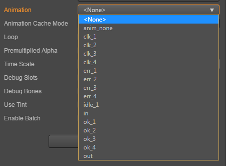
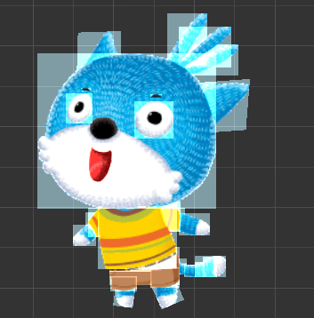

# sp.Skeleton

> 知识大纲
1. sp.Skeleton: 控制面板属性
    * Skeleton Data: 骨骼的控制文件.json文件;
    * Default Skin: 默认皮肤;
    * Animation:  正在播放的动画;
    * Loop: 是否循环播放;
    * Premultiplied Alpha 是否使用贴图预乘;
    * TimeScale: 播放动画的时间比例系数;
    * Debug Slots: 是否显示Slots的调试信息;
    * Debug Bone: 是否显示Bone的调试信息;
2. sp.Skeleton重要的方法，Skeleton是以管道的模式来播放动画，管道用整数编号，管道可以独立播放动画，Track 
    * clearTrack(trackIndex): 清理对应Track的动画
    * clearTracks(); 清除所有Track动画
    * setAnimation(trackIndex, "anim_name", is_loop)清除管道所有动画后，再重新播放
    * addAnimation(trackIndex, "anim_name", is_loop)往管道里添加一个动画 
    
> 练习
1. sp.Skeleton: 控制面板属性
    1. **animation** 先来讲最有兴趣的这个    
        * 我们可以看到对应的下拉框有这些
            
              
        
        * 这些数据又是哪来的，请看我们的**JXM.json**中有个key值就是**animation**  
        * 选中一个你有兴趣的动画，就可以运行啦
    2. **Loop** 是否循环播放  
        * 勾选了就是循环播放，不勾选则播放一次  
        
    3. **Premultiplied Alpha** 是否使用贴图预乘
        * 默认启用，启用后就会有你看到觉得不舒服的地方，这里我们还是来玩下**大家来找茬**吧，
            下面我会贴2张图分别时启用和不启用的
        
            
            
                
            
        * 区别很明显这边大家自己领悟感受哈  
    4. **Debug Slots** 是否显示Slots的调试信息
        * 这里截图给大家看下Slots调试
        
            
        
    5. **Debug Bone** 是否显示Bone的调试信息 
        * 这里截图给大家看下Bone调试
        
             
            
    6. **TimeScale** 调整动画速度
        * 默认是1，这里简单玩耍了下，改为2，动画速度变快，改为0.5，动画速度变慢        
          
                  