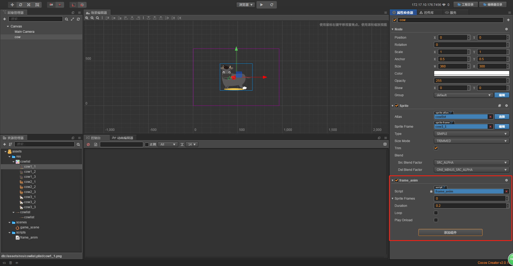
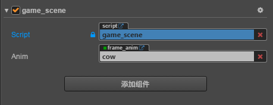

# 帧动画播放组件

> 知识大纲
1. creator播放帧动画需要通过动画编辑器去制作;
2. 为了方便控制和使用,加入帧动画代码播放组件;
3. 属性设置:
     * sprite_frames: 帧动画所用到的所有的帧;
     * duration: 每帧的时间间隔;
     * loop: 是否循环播放;
     * play_onload: 是否加载组件的时候播放;
4. 接口设置:
     * play_once(end_func); // 播放结束后的回调函数;
     * play_loop(); // 循环播放;
     
> 练习
1. 准备工作
    1. 新建项目后，把准备的素材放入res
    2. 新建**frame_anim.js**脚本
    
2. 开始玩耍
    1. 首先要明确我们需要编辑器绑定哪些属性
        1. 帧动画需要的每帧的图片，这里肯定是个数组
        2. 每帧播放的时间间隔
        3. 是否循环播放
        4. 是否加载组件的时候就播放
        5. 代码如下 
            ```
            properties: {
                sprite_frames: {
                    type: cc.SpriteFrame,
                    default: []
                },
                duration: 0.2, //每帧播放的时间间隔
                loop: false, //是否循环播放
                play_onload: false, //是否加载组件的时候就播放
            },
            ```             
    2. 把cow1_1拖拽至层级管理器Canvas下，改名为cow，并且添加前面的用户脚本
    
        
        
    3. 我们的帧动画一共有三帧，所以sprite_frames的值改为3，然后把我们的素材一次拖入
    
          
        
    4. 在写代码前我们先要了解下[帧动画播放的原理](./02-帧动画播放原理.md)
    5. 开始编写代码
        1. 对的时间播放对的图片，所以先要获取Sprite组件
            ```
            //获得精灵组件
            this.sprite = this.getComponent(cc.Sprite);
            if(!this.sprite){
                //没有获取到就添加这个组件
                this.sprite = this.addComponent(cc.Sprite);
            }        
            ```
        2. 播放有2种方式一种是循环，一种是播放一次，所以我们这边要写2个函数
            1. play_loop循环播放，没有结束动画的时候，所以这里不传参数
            2. play_once播放一次，这里会结束播放动画，所以传一个end_func作为回调函数
            3. play_loop调用后loop的属性改为true，play_once则改为false
            4. 添加标记is_playing,表示是否播放，在onLoad的时候初始化为false
            5. 在2个播放函数中is_playing应该改为true，这个标记方便在之后update函数中使用
            6. 具体代码如下
                ```
                play_loop(){
                    this.end_func = null;
                    this.loop = true;
                    this.is_playing = true;
                },
            
                play_once(end_func){
                    this.end_func = end_func;
                    this.loop = false;
                    this.is_playing = true;
                },
            
                // LIFE-CYCLE CALLBACKS:
            
                onLoad () {
                    this.end_func = null;
                    this.is_playing = false;
                    this.sprite = this.getComponent(cc.Sprite);
                    if(!this.sprite){
                        this.sprite = this.addComponent(cc.Sprite);
                    }
                    if(this.play_onload){
                        if(this.loop){
                            //循环播放
                            this.play_loop();
                        }else{
                            //只播放一次
                            this.play_once(this.end_func);
                        }
                    }
                },
                update (dt) {
                    if(!this.is_playing){
                        return;
                    }
                },    
                ```
        3. 编写帧动画播放逻辑
            1. 要有个变量记录播放的时间
                * 在onLoad里添加`this.play_time = 0`; 
                * 在2个播放函数里也同样增加这句代码
            2. 要根据播放方式不同写不同的逻辑
                ```
                update (dt) {
                    if(!this.is_playing){
                        return;
                    }
                    this.play_time += dt;
                    let index = Math.floor(this.play_time / this.duration);
                    if(!this.loop){
                        //播放一次的逻辑
                    }else{
                        //循环播放的逻辑
                    }
                },
                ```
            3. 播放一次的逻辑 
                ```
                //播放一次的逻辑
                if(index >= this.sprite_frames.length){
                    //超出索引了所以已经播放结束了
                    this.is_playing = false;
                    this.end_func && this.end_func();
                }else{
                    this.sprite.spriteFrame = this.sprite_frames[index]; //修改当前时刻显示的正确图片
                }
                ```   
            4. 循环播放的逻辑
                ```
                //循环播放的逻辑
                while(index >= this.sprite_frames.length){
                    index -= this.sprite_frames.length;
                    this.play_time -= (this.sprite_frames.length * this.duration);
                }
                this.sprite.spriteFrame = this.sprite_frames[index];
                ```    
            5. 2个开始播放的函数还需要初始化播放的时候默认是第一帧，所以在这2个函数中加上这句代码
                ```
                //初始化第一帧
                this.sprite.spriteFrame = this.sprite_frames[0];
                ```    
            6. 优化，在2个播放函数最前面加上校验   
                ```
                if(this.sprite_frames.length <= 0){
                    return;
                }
                ``` 
        4. 完整的代码是这样的
            ```
            cc.Class({
                extends: cc.Component,
            
                properties: {
                    sprite_frames: {
                        type: cc.SpriteFrame,
                        default: []
                    },
                    duration: 0.2,
                    loop: false,
                    play_onload: false,
                },
            
                play_loop(){
                    if(this.sprite_frames.length <= 0){
                        return;
                    }
                    this.end_func = null;
                    this.loop = true;
                    this.is_playing = true;
                    this.play_time = 0;
                    this.sprite.spriteFrame = this.sprite_frames[0];
                },
            
                play_once(end_func){
                    if(this.sprite_frames.length <= 0){
                        return;
                    }
                    this.end_func = end_func;
                    this.loop = false;
                    this.is_playing = true;
                    this.play_time = 0;
                    this.sprite.spriteFrame = this.sprite_frames[0];
                },
            
                // LIFE-CYCLE CALLBACKS:
            
                onLoad () {
                    this.end_func = null;
                    this.is_playing = false;
                    this.play_time = 0;
                    this.sprite = this.getComponent(cc.Sprite);
                    if(!this.sprite){
                        this.sprite = this.addComponent(cc.Sprite);
                    }
                    if(this.play_onload){
                        if(this.loop){
                            //循环播放
                            this.play_loop();
                        }else{
                            //只播放一次
                            this.play_once(this.end_func);
                        }
                    }
                },
            
                start () {
            
                },
            
                update (dt) {
                    if(!this.is_playing){
                        return;
                    }
                    this.play_time += dt;
                    let index = Math.floor(this.play_time / this.duration);
                    if(!this.loop){
                        //播放一次的逻辑
                        if(index >= this.sprite_frames.length){
                            //超出索引了所以已经播放结束了
                            this.is_playing = false;
                            this.end_func && this.end_func();
                        }else{
                            this.sprite.spriteFrame = this.sprite_frames[index]; //修改当前时刻显示的正确图片
                        }
                    }else{
                        //循环播放的逻辑
                        while(index >= this.sprite_frames.length){
                            index -= this.sprite_frames.length;
                            this.play_time -= (this.sprite_frames.length * this.duration);
                        }
                        this.sprite.spriteFrame = this.sprite_frames[index];
                    }
                },
            
            });

            ```    
    6. 运行看结果！！记得切换loop属性观察 
    7. 我们把cow属性检查器中的play onload改为false，这样就不会播动画了
    8. 在新建个**game_scene.js**脚本
        1. 在Canvas下添加这个脚本
        2. 把cow拖拽至anim这个属性上
        
            
        
        3. 编写脚本代码 
            ```
            let frame_anim = require("frame_anim");
            cc.Class({
                extends: cc.Component,
            
                properties: {
                    anim: {
                        type: frame_anim, 
                        default: null
                    },
                },
            
                // LIFE-CYCLE CALLBACKS:
            
                // onLoad () {},
            
                start () {
                    this.anim.play_once(function(){
                        console.log("end");
                    });
                },
            
                // update (dt) {},
            });
    
            ``` 
    9. 然后在运行~看到的确播放了一次，且控制台有打印信息`end`!          