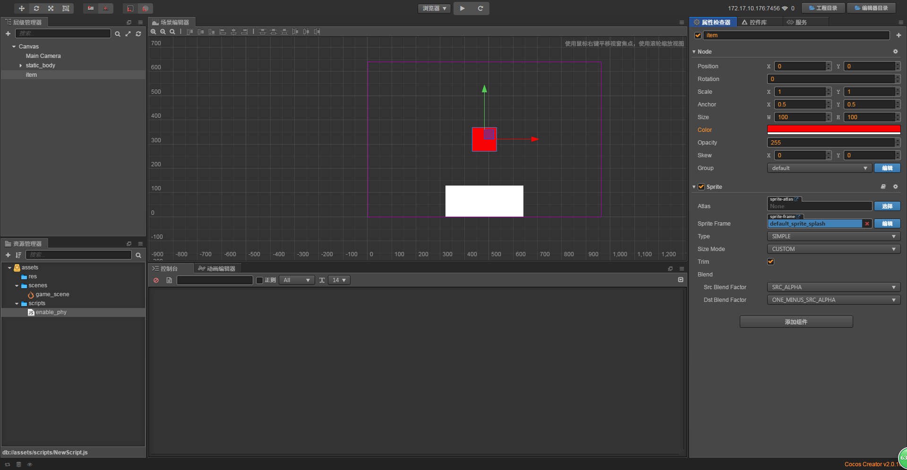

# 物理刚体

> 知识大纲
1. 刚体:形状不会改变
2. 刚体分为静态,动态刚体, 不受力的刚体(Kinematic,不受作用力的影响);
3. 刚体是受到物理作用的物体,由刚体带着节点移动;
4. 刚体组件cc.RigidBody:
      * enabledContactListener: 是否开启碰撞事件的监听;
      * bullet: 是否为子弹属性，防止高速穿越;
      * allowSleep: 是否允许进入休眠状态，一段时间后如果物体没有任何状态改变会进入休眠状态;
      * gravityScale: 该物体收重力的缩放;
      * linearDamping: 线性阻尼，衰减线性速度;
      * angularDamping: 角速度阻尼,衰减角速度;
      * linearVelocity: 刚体的线性速度;
      * angularVelocity: 刚体的角速度;
      * fixedRotation: 是否固定不旋转;
      * awake: 是否立刻唤醒此刚体;
      * active: 是否激活这个刚体，如果不激活，那么刚体不会参与碰撞;

> 练习
1. 原理
    * 首先请简单理解看下知识大纲的前2条
    * 刚体带着节点运动是什么鬼？
    * 这里可以举例说明，首先我们节点可能是个图片，图片里是个球
    * 然后我们在这个节点上绑定刚体组件
    * 这样引擎会计算好受到力的作用刚体会怎么动，从而带动这种图片在动
        这就是刚体带着节点移动的意思
2. 创建刚体
    1. 在Canvas下创建个空节点，取名为**static_body**    
    2. 然后在static_body的属性检查器中，添加组件->物理->RigidBody
        * 可以看下有以下这几个属性
        
            
            
        * Type属性，这里我们选择静态的
        
            
            
    3. 然后我们会发现这个刚体没有任何形状，这个时候我们需要添加[刚体碰撞器](./04-刚体碰撞器.md),
        添加好就能看到形状了 
    4. 当然我们也可以在节点下挂一个图片节点或者单色精灵什么的，然后大小改为和刚体碰撞器的大小一致
    5. 然后移动下这个静态刚体的位置
        
        
        
    6. 这里要强调几个点
        * 首先static_body添加了物理引擎的脚本，这个说明这个节点参与物理碰撞   
        * 然后物理碰撞器是代表的物理碰撞时计算碰撞的大小位置
        * 最后挂的单色精灵，是挂在static_body下的，这里就是前面说的刚体带动节点 
        * 所以物理引擎管着刚体，刚体带着节点，所以这个节点会做物理运动
    7. 我们在创建个刚体，这里先新建个单色精灵，取名为item，给它上个色-红色  
        
        
    
    8. 添加刚体组件，type使用默认的动态    
    9. 添加物理碰撞器，依然选择box
    10. 把这个item刚体放到高处，旋转一定角度，然后运行看下吧，就能看到明显的物理运动了
    
        
            
                  
