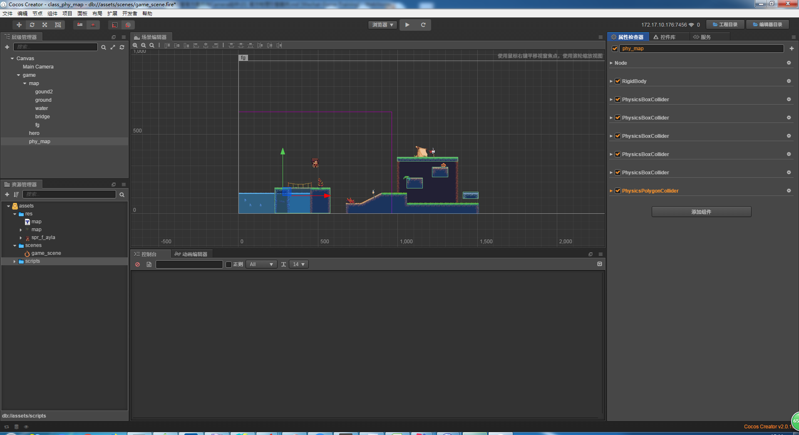
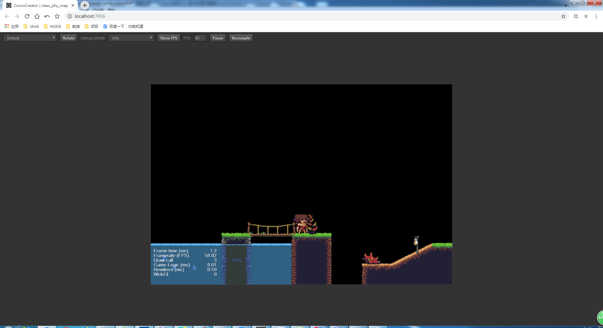

# 官方物理引擎案例

> 知识大纲
1. 准备好tiled地图;
2. 为tiled地图编辑好物理碰撞器;
3. 放出角色,为角色编辑好物理碰撞器;
4. 监听键盘事件
5. 设置角色的水平和竖直速度; 竖直600,水平400 
6. 设置cc.Camera组件,设置Camera跟随玩家; 

> 练习
1. 准备工作
    1. 新建项目，然后把素材放入res文件夹中
    2. 在Canvas下新建个空节点取名为game
    3. 拖动素材
        1. 把素材中的map(tiled)拖拽至game节点下，然后调整下位置
        2. 把素材中的**spr_f_ayla**拖拽到game节点下，取名为hero
        3. 如下图所示

                
          
    4. 把上次物理引擎的课程中的开启物理引擎的脚本**enable_phy.js**拿过来,
        放在scripts目录下，挂在Canvas节点下  
2. 开始玩耍
    1. 配置碰撞器
        1. 在game节点下新建个空节点，取名为phy_map，添加个Box的刚体碰撞器
        2. 修改组件的属性
            1. 刚体的type选为Static
            2. 选中Editing，调整至下图大小位置 
            
                  
                   
        3. 在添加第二个Box的刚体碰撞器
            * 选中Editing，调整至下图大小位置
            
                  
                
        4. 在添加三个Box的刚体碰撞器
            * 选中Editing，调整至下图的位置
            
                   
                
        5. 添加一个多边形Polygon的刚体碰撞器  
            * 选中Editing，调整至下图的位置
                    
                   
                
        6. 碰撞器的最终的效果应该就是这个样子，一共添加了六个碰撞器
                
            
            
        7. 为了快速的演示效果，我们的主角也加个Box的碰撞器
            
               
            
        8. 然后运行，我们就发现主角在重力的作用下掉在了地上
        
            
             
                                          