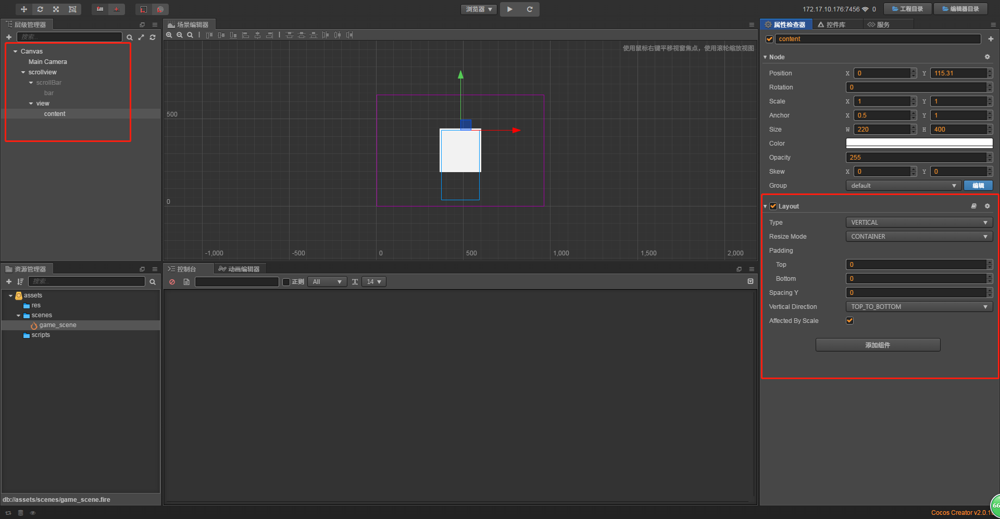
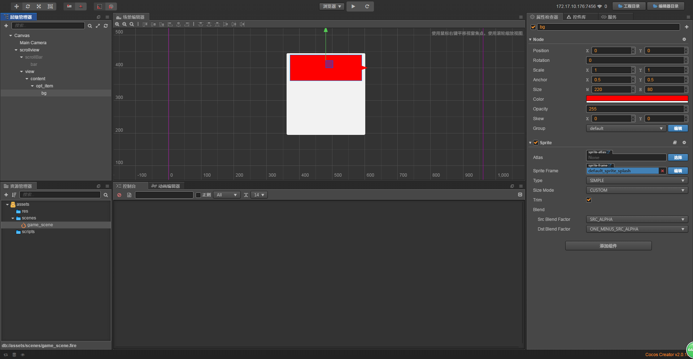
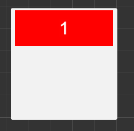

# 动态加载列表

> 知识大纲
1. 每个记录是滚动列表里面的一个项，我们将整个列表分为3页，每页固定的项的数目;
2. 一个PAGE的项最好超过滚动列表的大小;
3. 课程案例, 创建一个滚动列表
    * 每一个page为一个页,共3个页，每个page有8个项;
    * 3 * 8 = 24个项, 用1-100来模拟数据记录;
4. 编写代码往滚动列表里面加入所需要的项目;

> 练习
1. 在Canvas下新建一个ScrollView节点(Canvas右键->创建节点->创建UI节点->ScrollView),取名为scrollview

    
    
2. 我们把scrollBar节点隐藏掉，即把active属性不勾选
    
       
    
3. 接下来我们把content下的item删除，然后给content节点添加Layout组件(添加组件->UI组件->Layout) 
    * Type选择垂直布局
    * Resize Mode选择容器
    * Spacing Y改为10(这里一开始忘记加了，为了让之后每一项有间隔)
    * 如下图所示
    
        
    
4. 然后我们改下content的节点属性
    * Size的高度改为0，因为要动态加载
    * Position往上调整些，y的值改为120
    * 如下图所示
    
        
     
5. 在Content下新建一个空节点，代表的每一项内容，取名opt_item, 
    然后在opt_item下新建个单色精灵，取名为bg，作为每一项的背景颜色   
    * 如下图所示
    
        
        
    * 修改opt_item和bg的属性
        * opt_item和bg的Size都改为(220, 80)
        * bg的Color改为红色
    * 如下图所示 
        
            

6. 在opt_item下新建个Label节点(opt_item右键->创建节点->创建渲染节点->Label)，取名src
    * 如下图所示  
        
             
        
    * 修改Label的属性
        * String改为1
    * 如下图所示
        
        
        
7. 这样我们就可以做预制体了，把opt_item拖拽至res目录下，[不知道预制体是什么点击此处](../day-013-预制体,Mask,Layout,ScrollView/01-预制体.md)        

        
    
8. 预制体如何使用
    1. 我们就把res中的预制体**ope_item**往层级管理器下的content节点下拖
    2. 我们拖几个进去吧，如下图所示 
    
        
    
    
  
    
                     
 