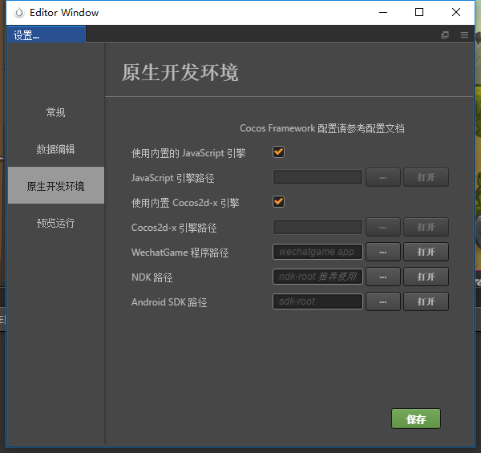

# android打包

> 知识大纲
1. 检查环境是否已经全装好: creator偏好设置;
2. 裁剪掉不用的模块
3. 构建项目，生成项目的编译发布环境和模板;
    * 版本 源码/二进制   启动的场景, 是否使用android studio
4. 点击编译, 启动编译打包生成APK;
5. 发布证书:
    * 调试证书与发布证书;
6. 包名: com.xxx.xxx,android应用的包名，android根据包名来确定是否为同一个应用;

> 练习
1. 如何检查环境是否安装好，点击菜单栏文件->设置，然后选择原生开发环境

    
    
2. 然后配置NDK和SDK，注意SDK要到sdk文件
3. 然后就可以构建发布了
    * 这里主要是发布平台要改为安卓  
    * 其他我基本都用了默认设置
    * 点击构建，构建成功后的界面是这样的
    
          
        
4. 编译，此处编译的时候失败了，尚未找到解决方案，应该是安装什么有问题，
    后续学习会有android studio打包，在来看解决问题      
          

