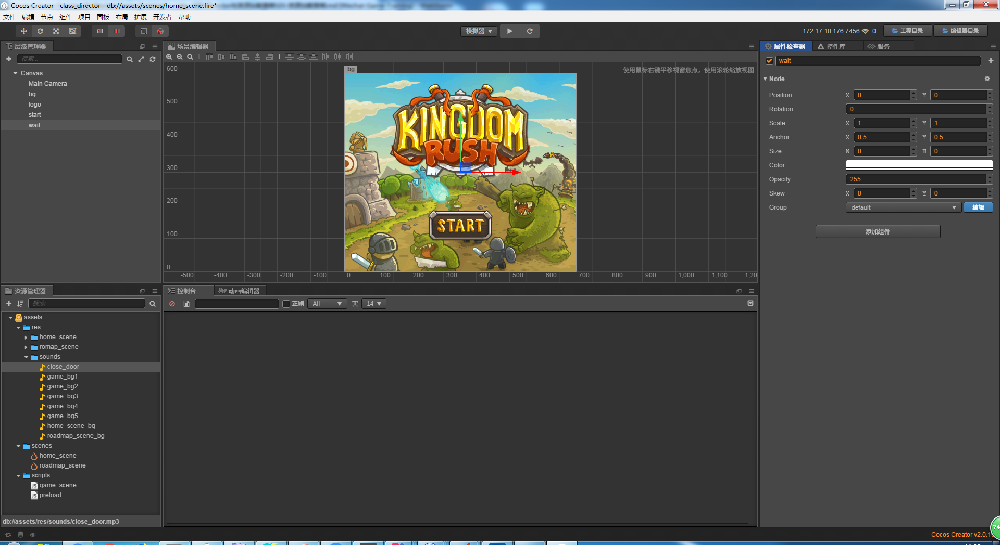
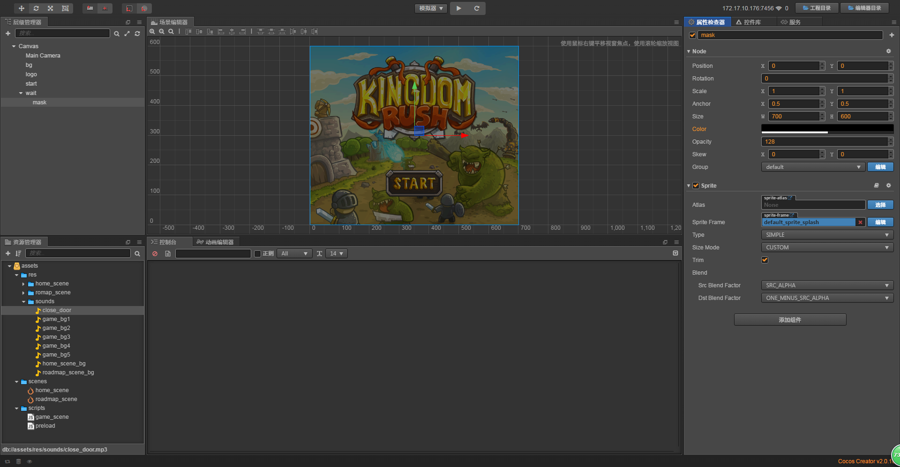
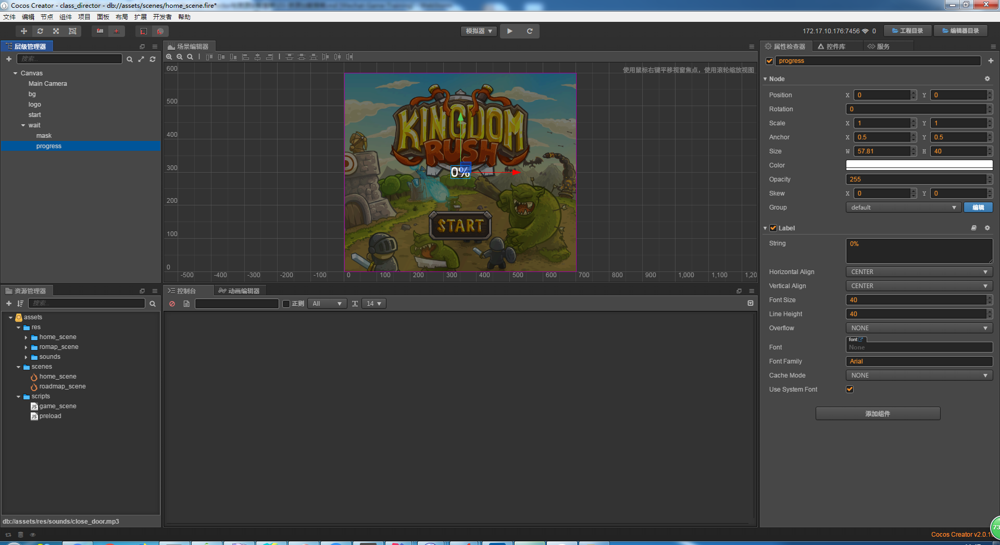
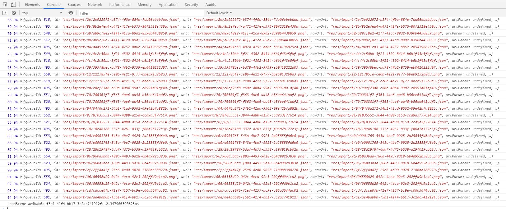

# 资源加载策略

> 知识大纲
1. h5资源加载的过程:
    * 从服务器上下载资源，并把资源加载到内存中,
        所以你在做h5游戏，你要把你当前游戏中要用到的资源先加载下来，
            否则的话,你在运行的时候去加载就来不及了(h5卡住);
2. 三种资源加载策略:
    1. h5的小游戏:采用全部提前绑定好所有的资源。编写预加载脚本preload.js,
        将要加载的资源手动关联到第一个启动的场景上面;
    2. 添加等待界面，预加载下一个场景，然后再进行切换,提前关联好下一个场景要的资源;    
    3. 嫌手动关联麻烦，在场景切换中加入过渡场景，代码来加载场景的资源,    
       代码加载资源会导致setting.js文件过大，一般尽量少在代码里面加载资源;
       
> 练习
* 三种资源加载策略我们一个一个来学习
    1. h5的小游戏预加载所有的资源
        1. 新建脚本**preload.js**, 挂在Canvas下(在场景**home_scene**) 
        2. 开始编写脚本,因为要绑定好所有资源，所以考虑到有图片，有图集，有声音，还有预制体...
            ```
            properties: {
                img_array: {
                    type: cc.SpriteFrame,
                    default: [],
                },
                atlas_array: {
                    type: cc.SpriteAtlas,
                    default: [],
                },
                sound_array: {
                    type: cc.AudioClip, 
                    default: [],
                },
                prefab_array: {
                    type: cc.Prefab,
                    default: [],
                }
            },
            ```
        3. 然后慢慢把资源拖拽进属性里
        4. 这个项目不太适合这样做，或者可以优化，因为图片很多，其实可以做成图集，这样就不会有过多的图片需要拖拽
    2. 添加等待界面 
        1. 前面第一种方法是把所有的资源都关联到第一个启动的场景上面，不太适合中，大型游戏
        2. 其实还有种方法就是分类preload，比如说home_scene的Canvas绑定preload组件，然后把home_scene要的资源绑定下，
            然后再在roadmap_scene的Canvas继续绑定个preload组件，把road_scene要的资源在绑定下
        3. 然后在做个优化，就是加个等待的界面，切记不能直接切换，这样会导致卡死，卡一段时间后才能进入下个场景
        4. 等待界面的实现
            1. 在home_scene的Canvas下创建个空节点，取名wait
            
                  
            
            2. 在wait下创建个单色精灵，取名mask，改成半透明黑色，大小记得改为(700, 600)
            
                   
                
            3. 记得给mask添加个Button组件，为了让用户不能点击下面，遮挡作用 
            4. 在wait节点下在新建个Label的节点，取名progress，代表我们的进度条，然后把string改成0%
            
                  
                
            5. 然后就可以编写我们的game_scene脚本了(其实这里应该命名规范的，
                因为我们挂在的是home_scene的Canvas下，感觉一开始命名起home_scene.js更合理)  
            6. 先编辑器绑定，把wait节点和Label节点绑定好
                ```
                properties: {
                    wait: {
                        type: cc.Node,
                        default: null,
                    },
                    progress_label: {
                        type: cc.Label,
                        default: null,
                    }
                },
                ```   
                
                    
            
            7. 添加逻辑
                ```
                cc.Class({
                    extends: cc.Component,
                
                    properties: {
                        wait: {
                            type: cc.Node,
                            default: null,
                        },
                        progress_label: {
                            type: cc.Label,
                            default: null,
                        }
                    },
                
                    // LIFE-CYCLE CALLBACKS:
                
                    onLoad () {
                        this.wait.active = false;
                        this.progress_label.string = "0%";
                    },
                
                    start () {
                
                    },
                
                    // update (dt) {},
                
                    goto_roadmap(){
                        this.wait.active = true;
                        //开始预加载
                        cc.director.preloadScene("roadmap_scene", function(completedCount, totalCount, item){
                            console.log(completedCount, totalCount, item);
                            let per = Math.floor(completedCount / totalCount * 100);
                            this.progress_label.string = per + "%"; 
                        }.bind(this),function(){
                            cc.director.loadScene("roadmap_scene");
                        })
                        
                    },
                });
                ```  
                
                      
       
