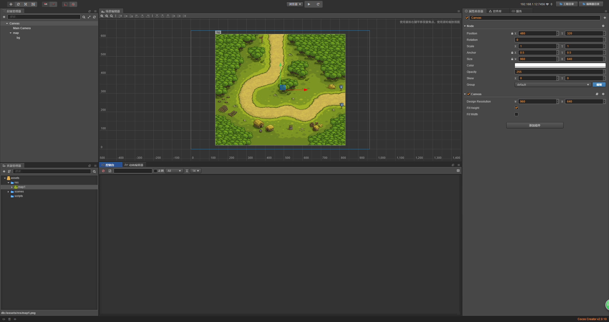
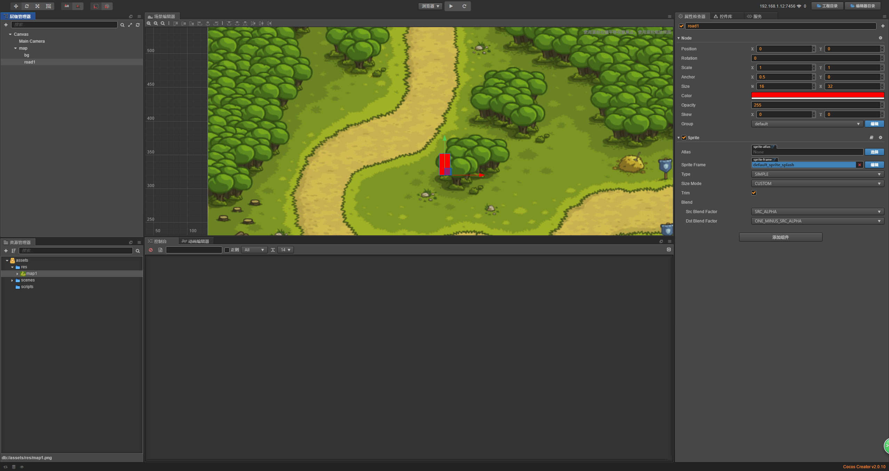
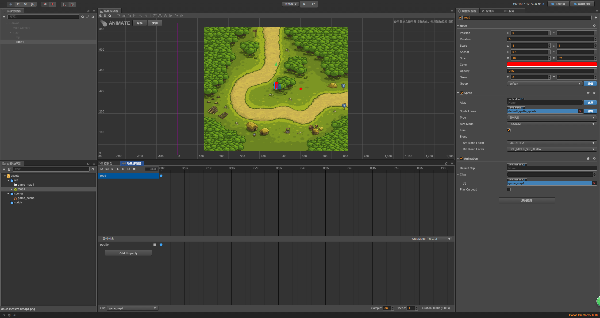
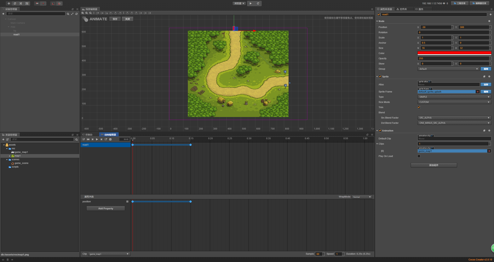
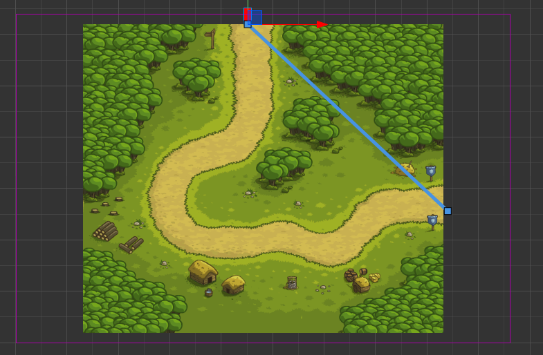
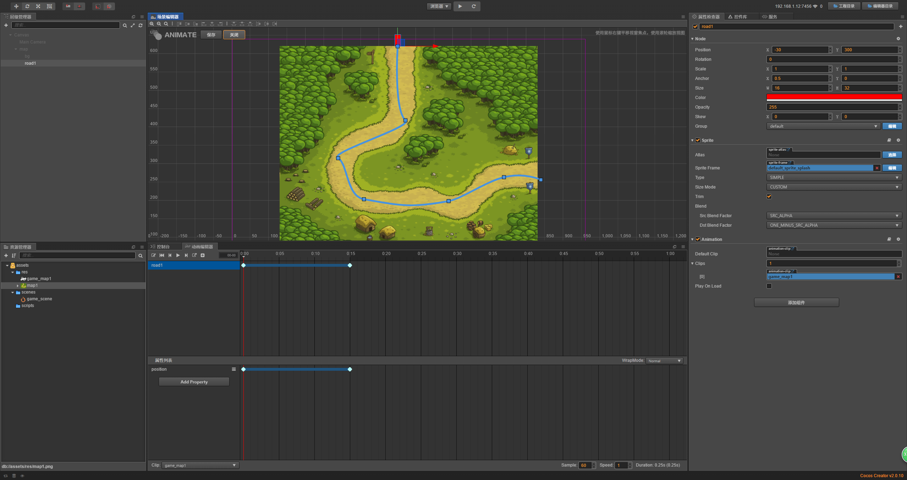

# 动画编辑器编辑地图路径

> 知识大纲
* 目标是学习用动画编辑器编辑地图路径

> 练习
1. 准备工作
    1. 把准备的资源放入res文件夹中
    2. 在Canvas下新建个空节点，取名为map
    3. 我们把前面的资源拖动到map下，取名为bg
    
        

2. 用动画编辑器制作路径
    1. 在map下新建个单色精灵
        1. 取名为road1
        2. 修改属性
            * 颜色改为红色
            * 锚点改为(0.5, 0)
            * Size改为(16, 32)
        3. 如图所示
            
            
                  
    2. 添加Animation组件，绘制地图路径  
        1. 给Map节点添加组件->其他组件->Animation 
        2. 在层级管理器中选中road1，然后点击场景编辑器下方的动画编辑器,点击新建Clip文件
            取名为**game_map1**,保存至res文件夹中
        3. 然后拖动到前面动画组件的Default Clip属性  
        4. 然后我们点击编辑，给road1添加属性，点击**Add Property**，选中position属性 
        5. 在position边上的按钮，点击插入关键帧
        
             
            
        6. 我们把第一帧的位置放在地图的起点，然后拖动红线到15s的位置，在添加关键帧，把我们的位置放在终点处              
        
            
            
        7. 我们可以点击下那条淡淡的虚线，它就会变粗 
        
              
            
        8. 然后我们可以点击虚线的任意点，然后拖拽编辑我们的路径，拖到满意为止然后保存 
        
                
            
        9. 这个曲线我们称为贝赛尔曲线，我们要生成地图路径是用个脚本生成的，源码小伙伴们自行研究
            1. 先把scripts中的**gen_map_path.js**拷贝到我们的scripts文件夹中
            2. 在节点**map**上挂这个组件 
            3. Canvas之前忘记改尺寸了，改为700*600  
            4. 运行就可以看到
            
                
            
3. 创建玩家，来走我们前面制作的地图路径
    1. 在map下创建个单色精灵，取名为player
    2. 和之前road1的属性差不多，颜色改为蓝色
    3. 创建个脚本，取名为actor，挂在player下，编写行走的脚本
        * 给编辑器绑定地图路径,然后把map节点拖拽至这个属性
            ```
            properties: {
                map: {
                    type: gen_map_path,
                    default: null,
                }
            },
            ```
        * 然后编写行走的逻辑,最终代码效果是
            ```
            var gen_map_path = require("gen_map_path");
            
            var State = {
                Idle: 0,
                Walk: 1,
                Attack: 2,
                Dead: 3,
            };
            
            cc.Class({
                extends: cc.Component,
            
                properties: {
            
                    map: {
                        type: gen_map_path,
                        default: null,
                    },
            
                    speed: 100,
                },
            
                // use this for initialization
                onLoad: function () {
                    
                },
            
                start: function() {
                    var road_set = this.map.get_road_set();
                    this.cur_road = road_set[0];
            
                    if (this.cur_road.length < 2) {
                        return;
                    } 
            
                    this.state = State.Idle;
                    var pos = this.cur_road[0];
                    this.node.setPosition(pos);
                    this.walk_to_next = 1;
            
                    this.start_walk();
                },
            
                start_walk: function() {
                    if (this.walk_to_next >= this.cur_road.length) {
                        // 攻击逻辑
                        this.state = State.Attack;
                        // 
                        return;
                    }
            
                    var src = this.node.getPosition();
                    var dst = this.cur_road[this.walk_to_next];
            
                    var dir = dst.sub(src);
                    var len = dir.mag();
            
                    this.vx = this.speed * dir.x / len;
                    this.vy = this.speed * dir.y / len;
                    this.walk_total_time = len / this.speed;
                    this.walked_time = 0;
            
                    this.state = State.Walk;
                }, 
            
                walk_update: function(dt) {
                    if (this.state != State.Walk) {
                        return;
                    }
            
                    this.walked_time += dt;
                    if (this.walked_time > this.walk_total_time) {
                        dt -= (this.walked_time - this.walk_total_time);
                    }
            
                    var sx = this.vx * dt;
                    var sy = this.vy * dt;
                    this.node.x += sx;
                    this.node.y += sy;
            
                    if (this.walked_time >= this.walk_total_time) {
                        this.walk_to_next ++;
                        this.start_walk();
                    }
                }, 
            
                // called every frame, uncomment this function to activate update callback
                update: function (dt) {
                    if (this.state == State.Walk) {
                        this.walk_update(dt);
                    }
                },
            });

            ```   
    4. 然后运行就能看到角色跑起来了~                  