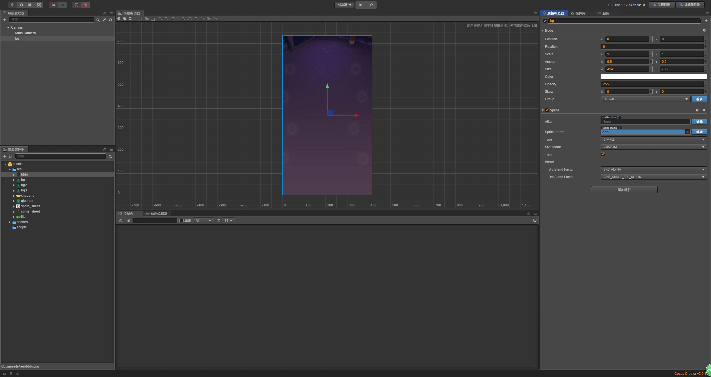
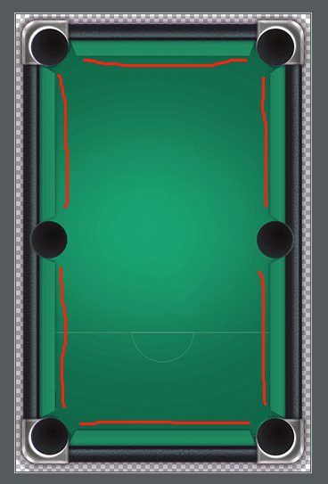
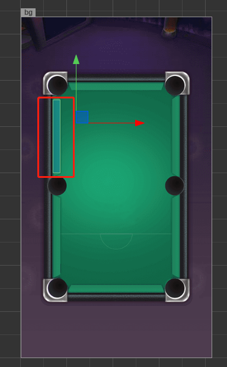
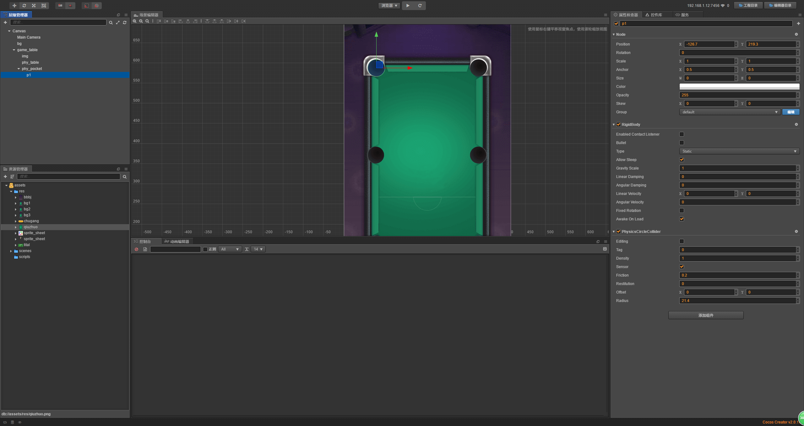

# 开启物理引擎

> 知识大纲
* [详细参考学习](../day-020-物理引擎基本配置/00-物理引擎基本配置.md)

> 练习
1. 布局工作
    1. 新建项目，新建3个文件夹(老样子，res，scripts，scenes)
    2. 把准备好的游戏资源copy到res文件夹中
    3. Canvas大小改为(414, 736),fit height和fit width一起勾选
    4. 把**bbbj.png**背景拖拽至Canvas下，改名为bg，在将大小改为(414, 736)
    
        
        
    5. 在Canvas下新建个空节点，取名为game_table,作为我们的球桌
    6. 制作球桌
        1. 把**qiuzhuo.png**拖拽至game_table在，取名为img    
        
            
            
        2. 配置球桌边缘
            1. 一共有6个边缘
                
                
            
            2. 我们在game_table下新建个空节点，取名为**phy_edge**，分组改为edge，刚体组件改为静态属性Static    
            3. 给phy_edge添加物理碰撞的组件 
            
                   
                
            4. 然后editing，调整下大小位置   
                
                 
                
            5. 接着把剩下的5个也做好
            
                
                
        3. 配置球桌球袋
            1. 在**game_table**下新建节点**phy_pocket**   
            2. 在phy_pocket新建空节点p1，意思是第一个球袋
            3. 添加物理碰撞组件，这里要用Circle，并且改为Static以及勾选Sensor，对了还有分组要改成pocket
            4. 然后editing，调整大小位置  
            
                   
            
            5. 配置剩下的球袋,这里要注意下细节，就是腰洞的位置，不应该和球洞的位置一致，
                因为母球可以贴着边缘从腰洞这边打过去的，如果位置一致，你们懂得~  
                
    7. 制作球
        1. 在Canvas下新建节点**ball_root**
        2. 我们能看到我们一共有这么几种球   
        
               
            
        3. 拖拽ball_red到ball_root下
        4. 修改其属性
            * 分组改为ball
            * 选择原始大小Raw
            * 添加物理碰撞组件，并调整大小
            * 弹性系数改为1
            * 线性阻力也改为1
            * 转动的阻力也改为1