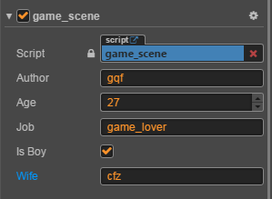
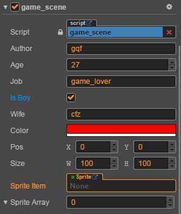
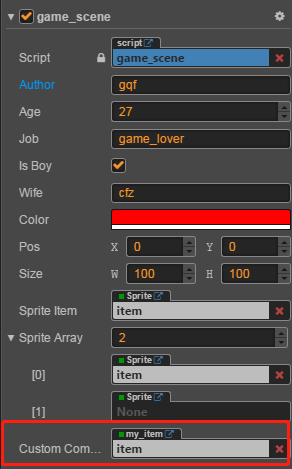

# cc.component属性

> 知识大纲
1. 组件类: 所有组件的基类
2. node: 指向这个组件实例所挂载的这个节点(cc.Node)
3. name: 这个组件实例所挂载的节点的名字<组件的名字>
4. properties - 属性列表
    1. name: value,number,boolean,string
    2. 位置，颜色，大小
    3. 组件
        * type: 组件类型，系统类型，也可以require自己编写的组件类型
        * default: null or [] 
    4. 其他: 打开cocos creator源码，找到参考，然后移动到你的代码里面
    
> 练习
1. 先说下代码组件里的this
    * 指向的是当前的组件实例
    * this.node指向了cc.Node，也就是这个组件所挂载的节点对象
    * 我们就在onLoad里添加`console.log(this.node)`，还记得我们把代码组件挂在Canvas下嘛
    
    
    
    * 这就是代码组件找对应的节点,直接通过`this.node`
    * `this.name`打印的是什么?我们来试下
    
    
    
    * 挂的节点是什么 + 代码组件的名字
    * `this.node.name` 就是节点名字 Canvas(小伙伴自己试下哈)
2. 属性列表
    1. 写在属性列表里，creator就可以可视化编辑了
        ```
        properties: {
            author: "gqf",
            age: 27,
            job: "game_lover",
            isBoy: true,
            wife: "cfz"
        },
        ```
        
          
    
    2. 基本数据类型 及 引用类型
        * 前面写的几个属性，有字符串有数字有布尔值，这里就不多说了
        * 写几个炫的   
        ```
        properties: {
            author: "gqf",
            age: 27,
            job: "game_lover",
            isBoy: true,
            wife: "cfz",
            color: cc.color(255, 0, 0),
            pos: cc.v2(0, 0),
            size: cc.size(100, 100)
        },
        ```
        
           
        
        * 牛逼了颜色位置大小都可以可视化编辑~~
        * 在写一点其他的，比如系统组件cc.Sprite,cc.Button,cc.Label......
        ```
        properties: {
            author: "gqf",
            age: 27,
            job: "game_lover",
            isBoy: true,
            wife: "cfz",
            color: cc.color(255, 0, 0),
            pos: cc.v2(0, 0),
            size: cc.size(100, 100),
            sprite_item: {
                type: cc.Sprite,
                default: null  //单个设为null
            },
            sprite_array: {
                type: cc.Sprite,
                default: []
            },
        },
        ```
        
          
        
        * 可以把左侧层级管理器的item节点拖到前面定义的系统组件
        * 关联组件的时候，是把节点的组件实例给它
        
          
        
        * 自己定义的组件怎么玩？
            1. 新建个脚本**my_item.js**,把脚本挂在item下
            2. 因为这个是我们自己的组件而不是系统组件，所以要先获得组件的构造函数
            ```
                let my_item = require("my_item");
                cc.Class({
                    .............
                    .............
                    .............
                });
            ```
            3. 然后就可以在属性列表里搞东西了呀
            ```
            properties: {
                author: "gqf",
                age: 27,
                job: "game_lover",
                isBoy: true,
                wife: "cfz",
                color: cc.color(255, 0, 0),
                pos: cc.v2(0, 0),
                size: cc.size(100, 100),
                sprite_item: {
                    type: cc.Sprite,
                    default: null
                },
                sprite_array: {
                    type: cc.Sprite,
                    default: []
                },
                custom_component: {
                    type: my_item,
                    default: null
                }
            },
            ```
            4. 再把左侧的层级管理器item拖进去
            
            
        
    3. 源码中找到你想要参考的属性，cv大法就可以了 
        * 安装目录下**engine**找你想要的属性
