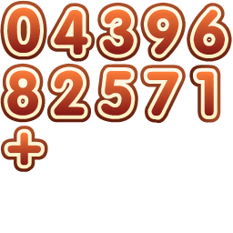
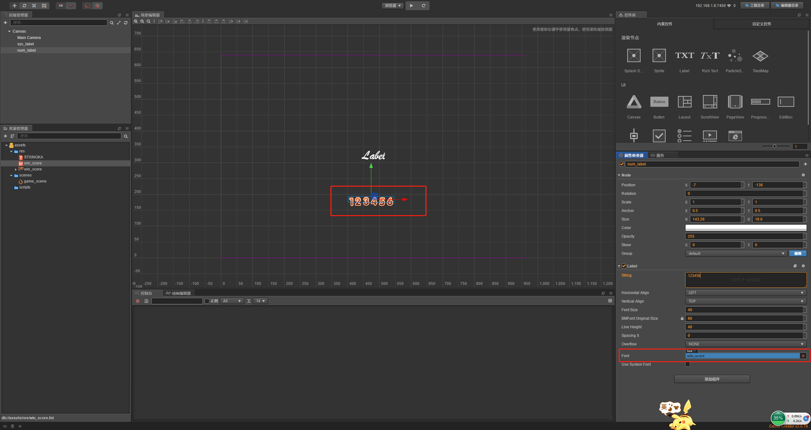

# 自定义字库

> 知识大纲
1. 准备好字体文件 .ttf矢量字库;使用矢量字体 , 优点: 灵活方便，缺点:字库文件占资源
2. 使用字体制作工具生成位图字体;使用位图字体;
3. 位图字体的优点与缺点:速度快，文件小;支持的字符个数是有限的;  
4. 自定义ttf字库与自定义位图字库: 个性化我们的字体,个性化系统没有的字库;
    自定义ttf字库，字符不限制，你这个字库里面有多少字符，就会支持, 灵活,占空间比较大
    位图字库,字符的个数是有限制的，省空间 
    
> 练习
1. ttf文件如何使用    
    1. 先把我们自定义的字库**STXINGKA.TTF**复制到我们的res文件中
    2. 把文件拖拽至**sys_label**的Font属性
    3. 这里自动把**Use System Font**取消选中了，然后我们可以看下现在字体的样子
        
        
        
    4. 自定义字库有什么用，就是为了文字的效果，具体优缺点参考本章知识大纲
2. 位图字体
    1. 我们先把**win_score.png**和**win_score.fnt**同样复制到我们的res文件中
        * **win_score.png**这个图片我们可以打开看下,这个数字样子还是不错的~
            
            
            
        * **win_score.fnt**我们用编辑器打开下看下
            ```
            info face="FZY4JW--GB1-0" size=86 bold=0 italic=0 charset="" unicode=0 stretchH=100 smooth=1 aa=1 padding=0,0,0,0 spacing=2,2
            common lineHeight=64 base=73 scaleW=256 scaleH=256 pages=1 packed=0
            page id=0 file="win_score.png"
            chars count=12
            char id=48 x=0 y=0 width=51 height=66 xoffset=2 yoffset=0 xadvance=56 page=0 chnl=0 letter="0"
            char id=52 x=53 y=2 width=52 height=65 xoffset=1 yoffset=0 xadvance=49 page=0 chnl=0 letter="4"
            char id=51 x=104 y=2 width=50 height=66 xoffset=3 yoffset=0 xadvance=56 page=0 chnl=0 letter="3"
            char id=57 x=155 y=0 width=50 height=68 xoffset=3 yoffset=0 xadvance=56 page=0 chnl=0 letter="9"
            char id=54 x=204 y=2 width=52 height=65 xoffset=3 yoffset=1 xadvance=56 page=0 chnl=0 letter="6"
            char id=56 x=0 y=68 width=50 height=67 xoffset=2 yoffset=0 xadvance=56 page=0 chnl=0 letter="8"
            char id=50 x=51 y=68 width=49 height=66 xoffset=4 yoffset=0 xadvance=56 page=0 chnl=0 letter="2"
            char id=53 x=100 y=68 width=52 height=66 xoffset=3 yoffset=1 xadvance=56 page=0 chnl=0 letter="5"
            char id=55 x=152 y=70 width=52 height=65 xoffset=1 yoffset=1 xadvance=56 page=0 chnl=0 letter="7"
            char id=49 x=208 y=68 width=36 height=67 xoffset=2 yoffset=1 xadvance=36 page=0 chnl=0 letter="1"
            char id=43 x=0 y=138 width=52 height=50 xoffset=3 yoffset=10 xadvance=51 page=0 chnl=0 letter="+"
            char id=32 x=54 y=134 width=0 height=0 xoffset=23 yoffset=64 xadvance=23 page=0 chnl=0 letter="space"
            ```    
        * 应该是在抠图，这应该就是每个字符对应的位置，位图字体大概就是这个意思
    2. 我们把**win_score.fnt**拖拽至**num_label**属性检查器中的Font属性
        1. 首先要注意我们的位图字体，都是数字，所以我们这边还要改变String属性，比如说写个`123456`
        2. 然后就可以看到效果了
        
              
            
        3. 位图字体的优缺点详见知识大纲        
    3. 两者之间的比较详见只是大纲    
         