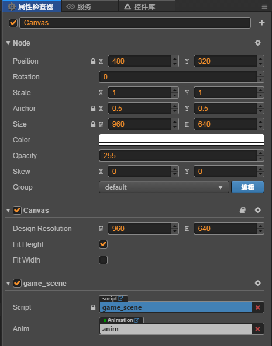

# Animation组件

> 知识大纲
1. 代码中获得cc.Animation组件: 
     * 编辑器关联; 
     * 代码获取组件;
2. Animation组件主要的方法:
     * play([name], [start_time]), 播放指定的动画，如果没有指定就播放默认的动画;
     * playAdditive: 与play一样，但是不会停止当前播放的动画;
     * stop([name]): 停止指定的动画，如果没有指定名字就停止当前播放的动画;
     * pause/resume: 暂停唤醒动画;
     * getClips: 返回组件里面带的AnimationClip数组
3. Animation重要的属性:
     * defaultClip: 默认的动画剪辑;
     * currentClip: 当前播放的动画剪辑;
4. Animation播放事件:  动画组件对象来监听on,不是节点
     * play : 开始播放时  
     * stop : 停止播放时 
     * pause : 暂停播放时 
     * resume : 恢复播放时
     * lastFrame : 假如动画循环次数大于1，当动画播放到最后一帧时 
     * finished : 动画播放完成时
     
> 练习
1. 代码中获得cc.Animation组件
    1. 编辑器关联
        * properties添加代码
        ```
        properties: {
            anim: {
                type: cc.Animation,
                default: null
            }
        },
        ```
        * 然后拖动anim到我们绑定的属性
        
            
            
    2. 代码获取组件 
        ```
        onLoad () {
            this.anim_com = this.node.getChildByName("anim").getComponent(cc.Animation);
            console.log(this.anim_com);
        },
        ```      
2. Animation组件主要的方法
    1. play
        ```
        start () {
            this.anim_com.play(); //默认直接播放defaultClip
            this.anim_com.play("anim_class");//播放anim_class,时间不指定就是直接播放
        },
        ```
    2. 剩下的自行查找API
3. Animation重要的常用属性就是知识大纲列举的这2个
    1. **defaultClip**: 默认的动画剪辑
    2. **currentClip**: 当前播放的动画剪辑    
4. Animation播放事件
    * 监听播放事件  
    ```
    onLoad () {
        var anim_node = this.node.getChildByName("anim");
        this.anim_com = anim_node.getComponent(cc.Animation);
        this.anim_com.on("play", function(){
            console.log("begin anim");
        }.bind(this),this)
    },
    ```
    * 其余监听事件小伙伴自行玩耍  