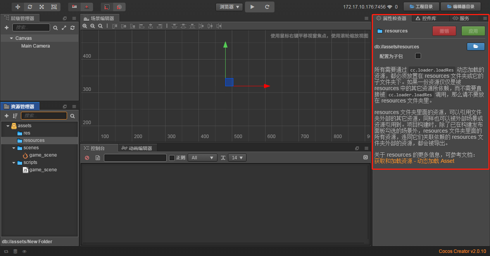

# cc.loader

> 知识大纲
1. 有三个默认的Pipeline:
    1. assetLoader: 主要用于加载资源, 加载asset类型资源，和释放这些资源;
    2. downloader: 主要用于下载文件, 文本,图像,脚本,声音,字体, 自定义的download;
    3. loader:  第三个默认的Pipeline,可以加载json, image, plist, fnt, uuid;
2. 资源分为[本地资源(assets目录下)](./02-本地资源加载.md)与[远程资源](./03-远程资源加载.md);  
3. 加载是异步的; 

> 练习
1. 这次新建项目和往常不太一样
    * 以往在assets文件夹下新建3个文件夹，分别是
        1. res - 放资源素材之类的
        2. scenes - 放游戏场景
        3. scripts - 放脚本
    * 这次要额外新建一个**resources**的文件夹，用于代码加载的资源
    * 新建后还能看到友好的提示    
    
        
    
2. resources文件夹在构建发布的时候肯定会被打包进去，其余的文件夹可选择是否打包 
3. 详细的内容[请点击这里学习](./02-本地资源加载.md)
